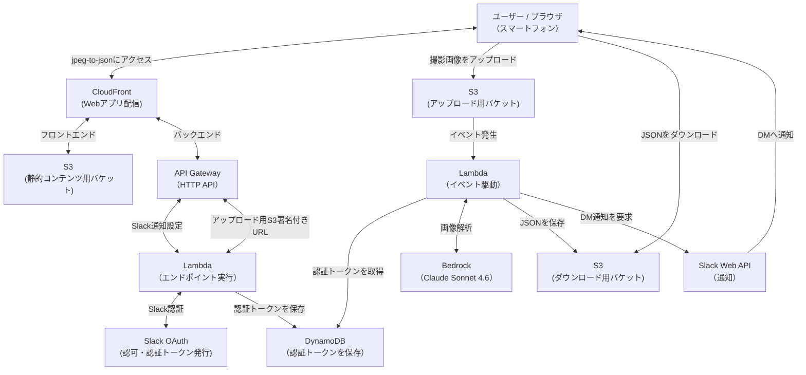

# jpeg-to-json

## デモ

```mermaid
flowchart TD
  U["ユーザー / ブラウザ<br/>（スマートフォン）"]

  CF["CloudFront<br/> (Webアプリ配信)"]
  DB["DynamoDB<br/>（認証トークンを保存）"]
  AI["Bedrock<br/>（Claude Sonnet 4.6）"]

  FE["S3<br/> (静的コンテンツ用バケット)"]
  IN["S3<br/> (アップロード用バケット)"]
  OUT["S3<br/> (ダウンロード用バケット)"]

  API["API Gateway<br/>（HTTP API）"]
  APP["Lambda<br/>（エンドポイント実行）"]
  PROC["Lambda<br/>（イベント駆動）"]

  OAUTH["Slack OAuth<br/> (認可・認証トークン発行)"]
  WEBAPI["Slack Web API<br/>（通知）"]

  U <-->|jpeg-to-jsonにアクセス| CF
  CF <-->|"フロントエンド"| FE
  CF <-->|"バックエンド"| API
  API <-->|"Slack通知設定"| APP
  API <-->|"アップロード用S3署名付きURL"| APP
  APP <-->|"Slack認証"| OAUTH
  APP -->|"認証トークンを保存"| DB

  U -->|"撮影画像をアップロード"| IN
  IN -->|"イベント発生"| PROC
   PROC -->|"認証トークンを取得"| DB
  PROC <-->|"画像解析"| AI
  PROC -->|"JSONを保存"| OUT
  PROC -->|"DM通知を要求"| WEBAPI
  WEBAPI -->|"DMへ通知"| U
  U -->|"JSONをダウンロード"| OUT
```
