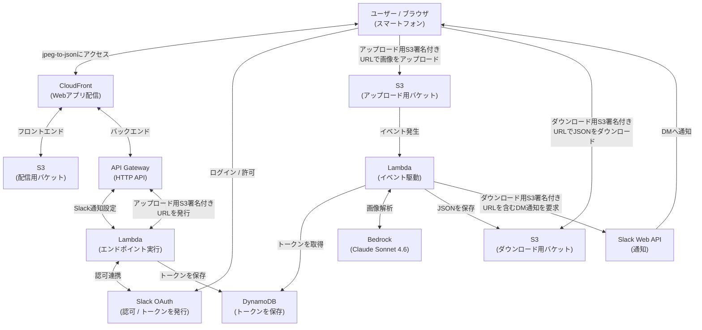

# jpeg-to-json

## 1. 概要

- スマートフォンで撮影したJPEG画像から情報を抽出し、JSON形式に変換するWebアプリです。
- 変換したJSONをダウンロードするURLを、SlackのDMへ通知します。

## 2. デモ（YouTubeショート / 音声あり）

## 3. システム構成

## 4. 開発目的

- 生成AIを用いて紙媒体から情報を抽出・構造化することで、業務効率化を支援することを目的としております。

- AWS SAP (AWS Certified Solutions Architect – Professional) 学習者向けハンズオン教材としての転用を視野に入れております。

## 5. 技術スタック

- 開発基盤
  | 項目 | 技術 |
  | :--- | :--- |
  | 開発環境 | Docker |
  | OS | Debian 13 |
  | ソース管理 | Git |
  | リポジトリ | GitHub |
  | CI/CD | GitHub Actions |

- バックエンド
  | 項目 | 技術 |
  | :--- | :--- |
  | 開発言語 | Go 1.26.3 |
  | 認可連携 | Slack OAuth |
  | 通知連携 | Slack Web API |

- フロントエンド
  | 項目 | 技術 |
  | :--- | :--- |
  | 開発言語 | TypeScript 6.0.3 |
  | 実行環境 | Node.js 24.19.0 |
  | UIライブラリ | React 19.2.7 |
  | ビルドツール | Vite 8.1.0 |

- インフラ（AWS）
  | 項目 | 技術 |
  | :--- | :--- |
  | 開発言語 | TypeScript 6.0.3 |
  | 実行環境 | Node.js 24.19.0 |
  | IaC | CloudFormation |
  | IaCフレームワーク | AWS CDK (aws-cdk-lib 2.263.0) |
  | IaC CLI | AWS CDK CLI 2.1127.0 |
  | ホスティング | CloudFront |
  | API基盤 | API Gateway |
  | APIタイプ | HTTP API |
  | 実行基盤 | Lambda |
  | ストレージ | S3 |
  | データベース | DynamoDB |
  | 生成AI基盤 | Bedrock |
  | モデル | Claude Sonnet 4.6 |
  | 秘匿情報管理 | Secrets Manager |

## 6. 技術選定

- AWSが提供するIaCサービス、CloudFormationを採用しました。

- CloudFormationテンプレートを生成することができるIaCフレームワーク、AWS CDKを採用しました。

- AWS公式ドキュメントやAWS CDKのTypeScript向けサンプルが充実しているため、インフラの開発言語にTypeScriptを採用しました。

- スマートフォンでの撮影・プレビュー・アップロード・結果表示のUIと画面状態を管理するため、UIライブラリであるReactを採用しました。

- コンパイル型言語による実行性能とLambdaとの親和性を考慮し、バックエンドの開発言語にGoを採用しました。

- 性能とコストのバランスを考慮し、画像解析モデルにClaude Sonnet 4.6を採用しました。

- CloudFrontを採用し、フロントエンドの配信とバックエンドへのアクセスを同一ドメインにまとめました。

- S3を採用し、アップロード用S3署名付きURLを用いてブラウザから撮影画像を直接アップロードする構成としました。

- Slackを採用し、画像解析完了後にダウンロード用S3署名付きURLをDMへ通知する構成としました。

- Slackとの認可連携を行うため、Slack OAuthを採用しました。

- Slack OAuthのクライアントシークレットを安全に取り扱うため、秘匿情報管理にSecrets Managerを採用しました。

- Slack OAuthで取得したアクセストークンをサーバーレスで管理するため、データベースにDynamoDBを採用しました。

## 7. 公開URL

  - [https://d1kpxnknxob065.cloudfront.net](https://d1kpxnknxob065.cloudfront.net)

## 8. ライセンス

- 本リポジトリは [MIT License](./LICENSE) のもとで公開しています。
