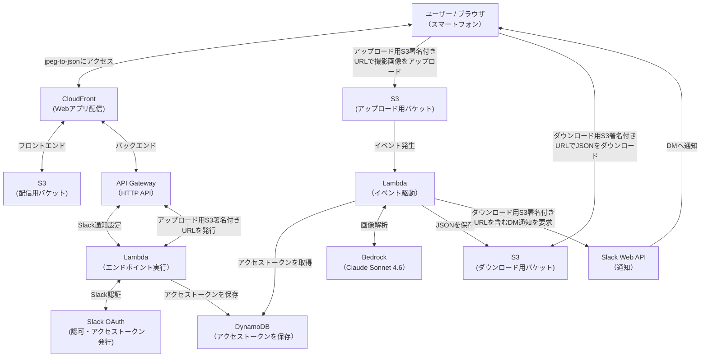

# jpeg-to-json

## 1. 概要

- スマートフォンで撮影したJPEG画像から情報を抽出し、JSON形式に変換するWebアプリです。
- 変換したJSONをダウンロードするURLを、SlackのDMへ通知します。

## 2. デモ（音声あり）

## 3. システム構成

## 4. 開発目的

- AWS SAP (AWS Certified Solutions Architect – Professional) のハンズオン教材として、Udemyでの販売を目的に開発しました。
- Excel形式に変換する拡張版のリリースを視野に入れております。

## 5. 技術スタック

- 共通
  | カテゴリー | 選定技術 |
  | :--- | :--- |
  | ソース管理 | Git |
  | リポジトリ | GitHub |
  | CI/CD | GitHub Actions |
  | 開発環境 | Docker |
  | OS | Debian 13 |

- バックエンド
  | カテゴリー | 選定技術 |
  | :--- | :--- |
  | 開発言語 | Go 1.26.3 |
  | 通知連携 | Slack Web API |

- フロントエンド
  | カテゴリー | 選定技術 |
  | :--- | :--- |
  | 開発言語 | TypeScript 6.0.3 |
  | 実行環境 | Node.js 24.19.0 |
  | ライブラリ | React 19.2.7 |
  | ビルドツール | Vite 8.1.0 |

- インフラ（AWS）
  | カテゴリー | 選定技術 |
  | :--- | :--- |
  | 開発言語 | TypeScript 6.0.3 |
  | 実行環境 | Node.js 24.19.0 |
  | IaC | CloudFormation |
  | IaCフレームワーク | AWS CDK (aws-cdk-lib 2.263.0) |
  | IaC CLI | AWS CDK CLI 2.1127.0 |
  | ホスティング | CloudFront |
  | API接点 | API Gateway |
  | APIタイプ | HTTP API |
  | 実行基盤 | Lambda |
  | ストレージ | S3 |
  | データベース | DynamoDB |
  | 生成AI基盤 | Bedrock |
  | モデル | Claude Sonnet 4.6 |
  | 秘匿情報管理 | Secrets Manager |

## 6. 技術選定

- AWSリソースをIaCとして定義し、CloudFormationテンプレートを生成することができるAWS CDKを採用しました。

- AWS CDKのサンプルが多いTypeScriptをインフラの開発言語に採用しました。

- ブラウザのカメラAPIを利用したユーザーインターフェイスと撮影画面の状態管理のため、Reactを採用しました。

- コンパイル型言語による実行性能とLambdaとの親和性を考慮し、バックエンドの開発言語にGo言語を採用しました。

- フロントエンドの配信とバックエンドへのアクセスを同一ドメインにまとめることができるCloudFrontを採用しました。

- S3署名付きURLを用いてブラウザから撮影画像を直接アップロードすることができるS3をストレージに採用しました。

- 性能とコストのバランスを考慮し、Claude Sonnet 4.6を画像解析に採用しました。

- LambdaからのSlack Web API呼び出し、DynamoDBでのアクセストークン管理、Secrets ManagerによるOAuthクライアントシークレット管理を実装し、AWS SAPで扱うサーバーレス構成の学習範囲を広げるため、Slackによる通知機能を採用しました。

## 7. 公開URL

  - [https://d1kpxnknxob065.cloudfront.net](https://d1kpxnknxob065.cloudfront.net)

## 8. ライセンス

- 本リポジトリは [MIT License](./LICENSE) のもとで公開しています。
